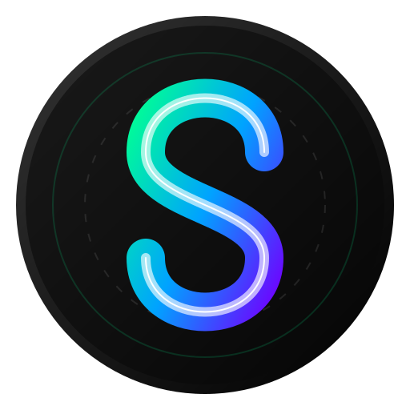

<div align="center">
  
  
  # Spatial Memories
  
  **Touch the Intangible. A futuristic, touchless 3D vault for your photo albums.**

  [](https://reactjs.org/)
  [](https://docs.pmnd.rs/react-three-fiber/)
  [](https://developers.google.com/mediapipe)
  [](https://supabase.com/)

  <p align="center">
    <a href="#features">Features</a> •
    <a href="#interaction-paradigm">Gestures</a> •
    <a href="#architecture">Architecture</a> •
    <a href="#getting-started">Installation</a>
  </p>
</div>

---

## 🌌 Overview

**Spatial Memories** (formerly Memory Sphere) is a paradigm shift in digital archiving. It abandons traditional 2D scrolling interfaces in favor of a boundless, interactive mathematical sphere. 

Using your webcam and Google's MediaPipe, you can navigate your photographic memories using pure spatial hand gestures—no mouse or keyboard required.

## ✨ Features

- **Touchless Spatial Navigation:** Navigate the 3D space using natural hand gestures.
- **Pinch-to-Grab Mechanics:** Advanced Apple Vision Pro style gesture resolution. 
  - *One-Hand Pinch:* Grab and navigate the memory sphere.
  - *Two-Hand Pinch:* Spread to zoom in, pinch to zoom out.
- **Customizable Navigation:** Toggle instantly between "Look Mode" (First-person view) and "Drag Mode" (Touchscreen surface) to match your mental model.
- **Vault Manager:** A frosted-glass dashboard for managing multiple isolated spheres. Features inline renaming, drag-and-drop uploads, and instant photo deletion.
- **Cloud Synchronization:** Fully integrated with Supabase for secure, real-time cloud storage and user authentication.
- **Premium UI/UX:** Awwwards-inspired landing page with smooth Framer Motion reveals, 3D Canvas backgrounds, and a high-performance spring-physics cursor.
- **Privacy First:** All computer vision hand-tracking runs 100% locally in your browser via WebGL. No video is ever sent to a server.

## ✋ Interaction Paradigm

We built a custom gesture engine to eliminate "domino effects" (accidental interactions) commonly found in hand-tracking apps. 

1. **Hovering (Safe Mode):** Open hands do nothing.
2. **Rotate (1-Hand Pinch):** Pinch your right thumb and index finger together to "grab" the sphere. Move your hand to spin it.
3. **Zoom (2-Hand Pinch):** Pinch both hands. Move them apart to zoom into a photo. 

## 🏗️ Architecture

The application is built on a modern, serverless stack designed for extreme frontend performance:

- **Frontend Framework:** Vite + React + TypeScript
- **3D Rendering:** Three.js via React Three Fiber (`@react-three/fiber`)
- **Computer Vision:** Google MediaPipe Hands (`@mediapipe/hands`)
- **Backend & Auth:** Supabase (PostgreSQL, Row Level Security, S3 Storage)
- **Styling:** TailwindCSS + Framer Motion

## 🚀 Getting Started

### Prerequisites
- Node.js 18+
- A free [Supabase](https://supabase.com/) account.

### Installation

1. **Clone the repository**
   ```bash
   git clone https://github.com/your-username/memory-sphere.git
   cd memory-sphere
   ```

2. **Install Dependencies**
   ```bash
   npm install
   ```

3. **Set up Environment Variables**
   Create a `.env` file in the root directory and add your Supabase keys:
   ```env
   VITE_SUPABASE_URL=your_supabase_url
   VITE_SUPABASE_ANON_KEY=your_supabase_anon_key
   ```

4. **Initialize Database**
   Run the provided SQL script in your Supabase SQL Editor to generate the necessary tables (`albums`, `photos`) and configure Row Level Security (RLS).

5. **Start Development Server**
   ```bash
   npm run dev
   ```

## 🤝 Contributing

This is an open-source experiment in spatial computing. Contributions are highly welcome!
Whether it's adding audio micro-interactions, optimizing the WebGL render pipeline, or improving the computer vision models, feel free to open a Pull Request.

## 📄 License

Distributed under the MIT License. See `LICENSE` for more information.
